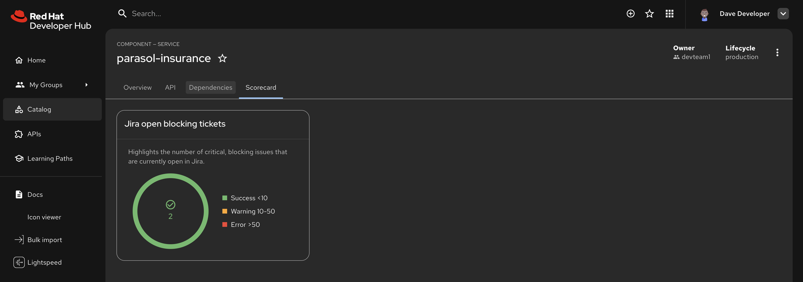

# RHDH Jira Stub

A lightweight Node.js service that implements the Jira REST API search endpoint (`GET /rest/api/2/search`). It returns deterministic fake data seeded from the project key, giving every RHDH catalog component realistic-looking Jira metrics without requiring a real Jira instance.

## Why

The RHDH Scorecards plugin supports Jira as a data source for project health metrics (open issues, bug counts, etc.), but we don't want to maintain a JIRA instance. This stub acts as a drop-in Jira backend that generates sample issues, so the scorecard plugin works out of the box in demo environments.



## Usage

Deploy the stub in your environment. It's available as a container image from `ghcr.io/redhat-ads-tech/rhdh-jira-stub`.

Next, install and configure the scorecard dynamic plugins:

> [!NOTE]
> The values below are an example. Refer to the [RHDH Scorecards documentation](https://docs.redhat.com/en/documentation/red_hat_developer_hub/1.8/html/understand_and_visualize_red_hat_developer_hub_project_health_using_scorecards/) for full configuration details.

```yaml
jira:
  proxyPath: /jira/api
  product: datacenter

proxy:
  endpoints:
    '/jira/api':
      # replace this with the URL to your Jira stub deployment!
      target: http://jira-stub.rhdh.svc.cluster.local:8080
      headers:
        Accept: application/json
        Content-Type: application/json
        X-Atlassian-Token: nocheck
      allowedMethods: ['GET', 'POST']
```

Catalog entities need a `jira/project-key` annotation:

```yaml
metadata:
  annotations:
    jira/project-key: PARASOL
```

## How It Works

1. The project key from the JQL query (e.g. `project=PARASOL`) is hashed with FNV-1a to produce a 32-bit seed
2. A Mulberry32 PRNG generates 5-24 issues per project with deterministic summaries, statuses, types, priorities, and dates
3. JQL filters (`type=Bug`, `resolution=Unresolved`, etc.) are applied as post-filters on the generated set

The same project key always produces the same issues, so metrics are stable across pod restarts.

## Endpoints

Both `/rest/api/2/` and `/rest/api/latest/` are supported for all endpoints.

| Method | Path | Description |
|--------|------|-------------|
| `GET` | `/health` | Returns `{"status":"ok"}` |
| `GET` | `/rest/api/{version}/project/{key}` | Project metadata and issue types |
| `GET` | `/rest/api/{version}/project/{key}/statuses` | Statuses grouped by issue type |
| `GET` | `/rest/api/{version}/search` | Search via query params |
| `POST` | `/rest/api/{version}/search` | Search via JSON body (used by Scorecards) |
| `POST` | `/rest/api/{version}/search/jql` | Alternate search endpoint |
| `GET` | `/rest/api/{version}/issue/{key}` | Single issue detail |
| `GET` | `/rest/api/{version}/user` | Stub user object |
| `GET` | `/rest/dev-status/1.0/issue/detail` | Empty PR data |
| `GET` | `/activity` | Empty activity stream |

## Running Locally

```bash
npm install
node index.js
```

```bash
curl 'http://localhost:8080/rest/api/2/search?jql=project=PARASOL'
```

## Configuration

| Variable | Default | Description |
|----------|---------|-------------|
| `HTTP_PORT` | `8080` | Server port |
| `HTTP_HOST` | `0.0.0.0` | Bind address |
| `NODE_ENV` | `production` | `production` or `development` |

## Container Image

Built automatically on push to `main` via GitHub Actions and published to `ghcr.io`.

```bash
podman build -f Containerfile -t rhdh-jira-stub .
podman run -p 8080:8080 rhdh-jira-stub
```
